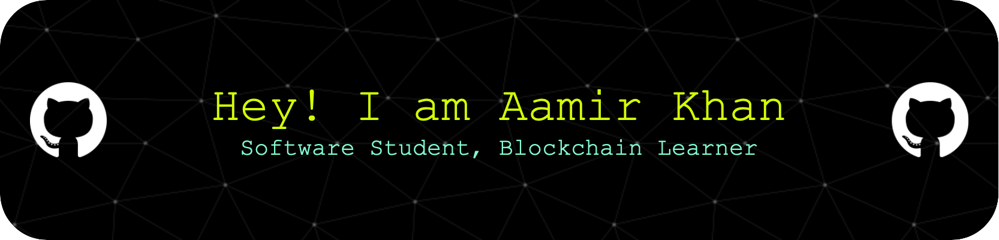

<h1 align="center">Hi 👋, I'm Muhammad Aamir Khan</h1>
<h3 align="center">Blockchain enthusiast and software engineering student, shaping the future.</h3>

-   🔭 I’m currently working on **modified Portfolio website**

-   🌱 I’m currently learning **react, solidity, Ethereum**

-   👨‍💻 My Portfolio [https://portfolio-of-aamir.netlify.app](https://portfolio-of-aamir.netlify.app)

-   💬 Ask me about **javaScript, CSS, HTML, react, Python**

-   📫 How to reach me **aamirkhan@engineer.com**

-   ⚡ **I learned every language from scratch through YouTube tutorials.**

<h3 align="left">Connect with me:</h3>

<h3 align="left">Languages and Tools:</h3>

       

